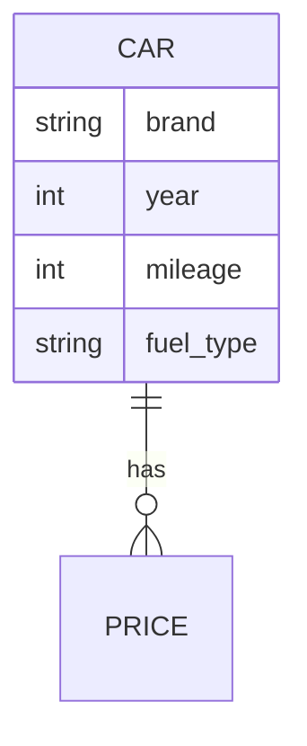
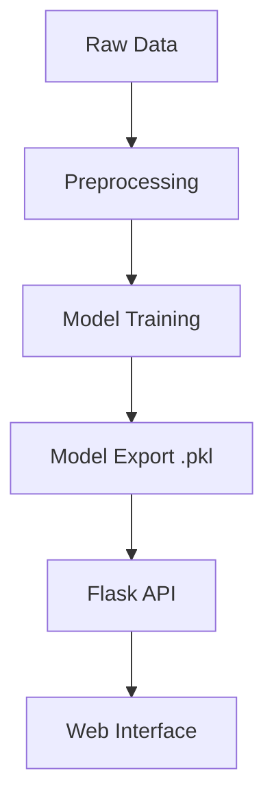

Here’s the **Software Requirements Specification (SRS) Document** for the **Used Car Price Prediction System**, formatted in clear English with technical details:

---

# **Software Requirements Specification (SRS)**  
**Project**: Used Car Price Prediction System  
**Version**: 1.0  
**Date**: 2024/08/15  

---

## **1. Introduction**  
### **1.1 Purpose**  
This document outlines the functional and non-functional requirements for a machine learning-based system to predict the market price of used cars based on features like brand, year, mileage, and fuel type.  

### **1.2 Scope**  
- Data preprocessing and cleaning  
- ML model training (XGBoost, Random Forest)  
- Simple web interface for real-time predictions  

### **1.3 Audience**  
- ML Developers  
- Data Scientists  
- Product Managers  

---

## **2. Functional Requirements**  
| **ID** | **Requirement** | **Description** |  
|--------|-----------------|-----------------|  
| FR1 | Data Preprocessing | Handle missing values, encode categorical features (e.g., brand, fuel type) |  
| FR2 | Model Training | Train regression models (XGBoost, Random Forest) with hyperparameter tuning |  
| FR3 | Prediction API | Expose model predictions via a Flask-based REST API |  
| FR4 | Web Interface | User-friendly UI to input car details and display predicted price |  

---

## **3. Non-Functional Requirements**  
| **ID** | **Requirement** |  
|--------|-----------------|  
| NFR1 | Model accuracy ≥ 85% (RMSE metric) |  
| NFR2 | API response time < 2 seconds |  
| NFR3 | Compatibility: Python 3.8+, Windows/Linux |  

---

## **4. Data Model**  
### **4.1 ER Diagram**  


### **4.2 Sample Data**  
```json
{
  "brand": "Toyota",
  "year": 2018,
  "mileage": 45000,
  "fuel_type": "gasoline",
  "price": 15000
}
```

---

## **5. System Architecture**  


---

## **6. Constraints**  
- Limited data for luxury/rare car models  
- Predictions may vary regionally (trained on US-based data)  

---

## **7. Appendices**  
- **Dataset Source**: [Kaggle Dataset](https://www.kaggle.com/datasets/austinreese/craigslist-carstrucks-data)  


---

